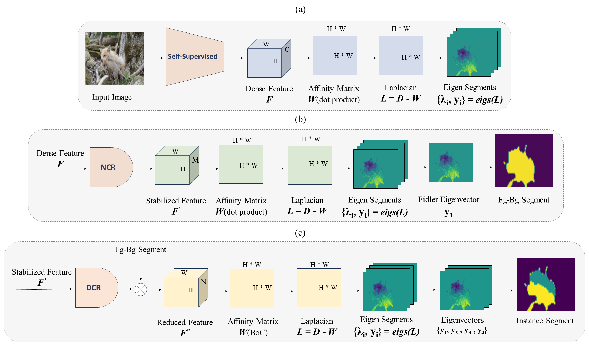

This repository contains the source code for [Deep Spectral Improvement for Unsupervised Image Instance Segmentation]([https://](https://arxiv.org/pdf/2402.02474))<br/>



The code has been tested with python 3.7.12 and PyTorch 1.9.1+cu111

```Shell
conda create --name specuniis
conda activate specuniis
```

## Required Data
To evaluate/train specuniis , you will need to download the required datasets.
* [Youtube-Vis 2019](https://youtube-vos.org/dataset/vis/)
* [PascalVOC2012](https://host.robots.ox.ac.uk/pascal/VOC/voc2012/) <br>
* To facilitate easy testing, you can download the YouTube-VIS2019 Annotation from [here](https://drive.google.com/file/d/1SPskvTlj1tsl0uAH_ujERSCccp65WfMf/view?usp=sharing)

## How to run?

Feature extraction
```Shell
python extract.py extract_features \
    --images_list "ytvs2019_10k.txt" \
    --images_root "ytb_images_train" \
    --output_dir "features/dino_vits16" \
    --model_name dino_vits16 \
    --batch_size 1
```
Eigenvector extraction
```Shell
python extract.py extract_eigs \
    --images_root "ytb_images_train" \
    --features_dir "features/dino_vits16" \
    --which_matrix "laplacian" \
    --output_dir "eigs/laplacian" \
    --K 5 --dr 3 #What fraction of channels should be conserved based on entropy? default is 1/3
```
Fg-Bg segmentation
```Shell
python extract.py extract_single_region_segmentations \
    --features_dir "features/dino_vits16" \
    --eigs_dir "eigs/laplacian" \
    --output_dir "fgbg_mask"
```
Eigenvector extraction suitable for instance segmentation
```Shell
python instance.py --type 'extract_eigs' --feats_root 'features/dino_vits16/' --fgbg_root 'fgbg_mask/' \
            --export_root 'eigs_instance/' \
            --std_threshold 60
```
Clustring
```Shell
python instance.py --type 'clustring' --eigs_root 'eigs_instance/' --fgbg_root 'fgbg_mask/' \
            --export_root 'instance_clustring/' --gt_root 'AnnTrue/'
```
Evaluation of FG-BG
```Shell
python eval.py --type 'fgbg' --pred_root 'fgbg_mask/' --gt_root 'AnnTrue/' 
```
Evaluation of instance segmentation
```Shell
python eval.py --type 'instance' --pred_root 'instance_clustring/' --gt_root 'AnnTrue/' 
```
            
### Acknowledgement
This codebase is heavily borrowed from [Deep Spectral Methods for Unsupervised Localization and Segmentation](https://github.com/lukemelas/deep-spectral-segmentation). Thanks for their excellent work.
